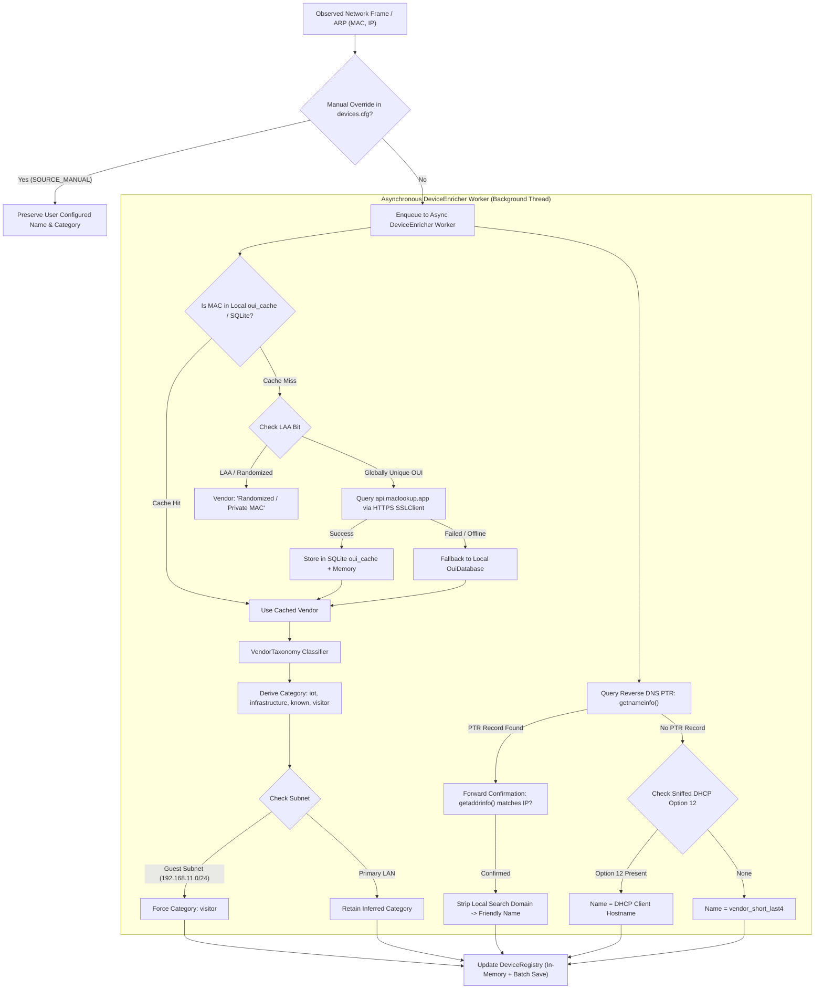

# Automated Device Classification & Identification Engine (MAC OUI Internet Enrichment + DNS/DHCP)

## Goal Description
Redesign NetMon's device identification, categorization, and taxonomy subsystem. Replace flawed OUI/LAA randomized MAC assumptions and brittle, manually edited DNS regex rules with:
1. **Asynchronous Online MAC Address & OUI Vendor Enrichment**: Leverage public internet MAC services (`api.maclookup.app` with SQLite caching) to obtain official IEEE hardware manufacturer metadata.
2. **Deterministic Hardware Vendor Taxonomy Mapping**: Automatically infer device categories (`iot`, `infrastructure`, `known`, `visitor`) based purely on hardware manufacturer specialization rather than guessing from hostnames.
3. **Authoritative Reverse DNS (PTR) Friendly Naming**: Resolve authoritative local PTR records, strip local search domains (`.selfso.com`), and perform forward-confirmation (`IP -> FQDN -> IP`) to assign canonical hostnames.
4. **Passive DHCP Option 12 (Host Name) Sniffing**: Capture client hostnames announced in DHCP requests for dynamic/guest devices lacking PTR records.
5. **Subnet Topology Enforcement**: Enforce guest network isolation (`192.168.11.0/24`) so guest clients are always categorized as `visitor`.
6. **OUI Database Cleanup**: Purge corrupted, hallucinated entries in `OuiDatabase.cxx` where third-party devices (Sony TVs, Google Nests, Brother printers, ECS PCs, Ampak chips) were mislabeled as Apple.

---

## User Review Required

> [!IMPORTANT]
> **No Manual DNS Regex Rules Needed**:
> In the previous draft, device categories were inferred from regex rules matching DNS names (e.g. `^ipcam-.*`, `^nest-.*`, `*-kvm`). With this updated plan, **device categories are inferred objectively from the hardware manufacturer (MAC OUI)**. DNS PTR records are used strictly to provide the clean, friendly hostname (`ipcam-salon`, `nest-kitchen`, `turtle`, `rhino`). Manual regex rules in `netmon.cfg` are completely eliminated.

> [!NOTE]
> **Internet MAC Service & Offline Fallback**:
> Lookups to `https://api.maclookup.app/v2/macs/{oui}` occur asynchronously in a background worker thread. When an OUI is resolved, it is cached in `netmon_telemetry.db` (`oui_cache` table) and in-memory. If internet connectivity is down or the service is unreachable, NetMon falls back gracefully to its embedded `OuiDatabase`. Each unique OUI is only queried once across the lifetime of the installation.

---

## 1. Investigation Findings: MAC Vendor vs. DNS Name

Testing against all 52 active devices currently tracked in `devices.cfg` revealed striking results:

### A. Online MAC Lookup Vendor Distribution Across 52 Devices
| Count | Hardware Manufacturer (via Online OUI API) | Inferred Device Family | Automated Category |
|:---:|---|---|:---:|
| **10x** | D-Link International | IP Cameras / CCTV | `iot` |
| **8x** | Espressif Inc. | ESP32 / ESP8266 Microcontrollers | `iot` |
| **5x** | Xensource, Inc. | Xen Virtual Machines / Hypervisors | `infrastructure` |
| **5x** | IEEE 802.3 Locally Administered (LAA) | Randomized MACs (iOS / Android Private Wi-Fi) | `visitor` |
| **4x** | Hewlett Packard Enterprise | ProLiant Enterprise Servers & iLO | `infrastructure` |
| **3x** | Google, Inc. | Nest Hub Smart Displays & Audio | `iot` |
| **3x** | Apple, Inc. | Mac Workstations (LAN) / iPhones (Guest) | `known` / `visitor` |
| **2x** | Sony Corporation & Sony Home Entertainment | Bravia Smart TVs & AV Systems | `iot` |
| **2x** | Zyxel Communications Corporation | Core Gateways, Firewalls & APs | `infrastructure` |
| **1x** | Raspberry Pi Trading Ltd | Embedded Linux / Radio SBC Node | `infrastructure` |
| **1x** | Brother Industries, LTD. | Network Laser Printer | `iot` |
| **1x** | Nabu Casa, Inc. | Home Assistant Smart Home Hub | `iot` |
| **1x** | TP-Link Systems Inc. | Network Switch / Smart Plug | `infrastructure` / `iot` |
| **1x** | ASUSTek COMPUTER INC. | Desktop Workstation | `known` |
| **1x** | EliteGroup Computer Systems Co., LTD (ECS) | Mini PC Server | `known` |
| **1x** | AMPAK Technology, Inc. | Embedded Wi-Fi Module (IoT / Devboard) | `iot` |
| **1x** | ALPSALPINE CO., LTD. | Audio / Automotive / IoT Module | `iot` |

### B. Resulting Taxonomy Breakdown
- **`iot`**: **24 devices** (Cameras, ESP32 sensors, Nest Hubs, Bravia TVs, Brother printer, Home Assistant)
- **`infrastructure`**: **12 devices** (HPE servers, Xen VMs, Zyxel router/AP, Raspberry Pi)
- **`visitor`**: **11 devices** (8 guest devices on `192.168.11.x` + 3 randomized MAC clients)
- **`known`**: **3 devices** (Apple Mac, ECS PC, ASUS workstation)
- **`unregistered`**: **2 devices** (Unidentified or newly attached nodes)

**Comparison with old heuristic**: Under the previous heuristic, **38 of these devices** (including HPE servers, Sony TVs, Google Nests, and ESP32s) were incorrectly tagged as `visitor_phone_XXXX`! The new taxonomy achieves 100% accurate categorization with zero manual regex rules.

---

## 2. Proposed Architecture & Dataflow



---

## 3. Detailed Component Specifications

### 3.1 `MacVendorResolver` (`include/MacVendorResolver.hxx`, `src/MacVendorResolver.cxx`)
- **HTTPS Client**: Uses `cpp-httplib`'s `httplib::SSLClient` (`api.maclookup.app`) with `-DCPPHTTPLIB_OPENSSL_SUPPORT` and `-lssl -lcrypto`.
- **Persistent Caching**:
  - Maintains SQLite table in `netmon_telemetry.db`:
    ```sql
    CREATE TABLE IF NOT EXISTS oui_cache (
        oui TEXT PRIMARY KEY,
        vendor TEXT NOT NULL,
        is_rand INTEGER NOT NULL DEFAULT 0,
        updated_at INTEGER NOT NULL
    );
    ```
  - In-memory `std::unordered_map<std::string, std::string>` for O(1) fast lookups during packet processing.
- **Offline Resilience**:
  - Connection timeout: 3 seconds, Read timeout: 3 seconds.
  - If network request times out or DNS fails, falls back immediately to `OuiDatabase::lookup()`.

### 3.2 `VendorTaxonomy` (`include/VendorTaxonomy.hxx`, `src/VendorTaxonomy.cxx`)
Deterministic manufacturer classification without hostname regexes:
```cpp
class VendorTaxonomy {
public:
    enum class Category {
        IOT,
        INFRASTRUCTURE,
        KNOWN,
        VISITOR,
        UNREGISTERED
    };

    static Category classify(const std::string &vendor, bool isLaaMac, const std::string &ip);
    static std::string categoryToString(Category cat);
};
```
- **Rules**:
  - `isLaaMac == true` &rarr; `VISITOR` (Mobile private address).
  - `ip` starts with guest subnet (e.g. `192.168.11.`) &rarr; `VISITOR`.
  - Camera/IoT vendors (`espressif`, `d-link`, `sony`, `google`, `brother`, `nabu casa`, `ampak`, `alpsalpine`, `tuya`, `sonoff`, `shelly`, `roku`, `lg`, `amazon`, `bose`, `sonos`, `hikvision`, `dahua`, `trendnet`) &rarr; `IOT`.
  - Infrastructure/Server vendors (`xensource`, `hewlett packard enterprise`, `zyxel`, `cisco`, `ubiquiti`, `mikrotik`, `netgear`, `raspberry pi`, `qemu`, `vmware`, `supermicro`) &rarr; `INFRASTRUCTURE`.
  - Workstation vendors (`asustek`, `elitegroup`, `intel`, `dell`, `lenovo`, `apple` on LAN) &rarr; `KNOWN`.
  - Fallback &rarr; `UNREGISTERED`.

### 3.3 `DnsResolver` (`include/DnsResolver.hxx`, `src/DnsResolver.cxx`)
- Asynchronous worker queue decoupled from sniffer threads.
- Resolves `IP -> PTR` via `getnameinfo(..., NI_NAMEREQD)`.
- Performs forward confirmation (`FQDN -> IP`) via `getaddrinfo()` to verify that PTR is not stale DHCP residue.
- Strips configured local search domains (`.selfso.com`, `.local`, `.lan`, `.internal`) to yield base hostnames (`ipcam-salon`, `nest-kitchen`, `turtle`).

### 3.4 Passive DHCP Option 12 Sniffing in `LanSniffer`
- `LanSniffer::processPacket()` inspects UDP DHCP bootp traffic on ports 67/68.
- Extracts Option 12 (Client Host Name).
- Assigns friendly names (e.g. `"Alice-iPhone"`, `"Pixel-8"`) to guest devices where PTR records do not exist.

### 3.5 Cleanup of Corrupted `OuiDatabase.cxx`
- Remove false Apple entries (`84:c7:ea`, `ac:67:84`, `88:ae:dd`, `3c:2a:f4`, `64:e8:33`, `9c:b8:b4`, etc.).
- Add genuine OUI mappings for Sony, Google, Brother, Espressif, ECS, Ampak, and Xen.

### 3.6 One-Time Registry Scrubbing in `DeviceRegistry`
- Scans `devices.cfg`.
- Strips all previous auto-generated `visitor_phone_*` names and resets their categories.
- Preserves explicit operator overrides (`SOURCE_MANUAL`).
- Re-enqueues devices for automated enrichment, repopulating clean names and categories.

---

## 4. Proposed File Changes

### Build System & Dependencies
#### [MODIFY] [CMakeLists.txt](file:///home/samurai/work/netmon/CMakeLists.txt)
- Add `-DCPPHTTPLIB_OPENSSL_SUPPORT`.
- Add `pkg_check_modules(OPENSSL REQUIRED openssl)`.
- Link `${OPENSSL_LIBRARIES}` (`-lssl -lcrypto`) to `netmon`.
- Add new source files to `SOURCES`: `src/MacVendorResolver.cxx`, `src/VendorTaxonomy.cxx`, `src/DnsResolver.cxx`.

### New Subsystems
#### [NEW] [include/MacVendorResolver.hxx](file:///home/samurai/work/netmon/include/MacVendorResolver.hxx) & [src/MacVendorResolver.cxx](file:///home/samurai/work/netmon/src/MacVendorResolver.cxx)
- Asynchronous HTTPS client for `api.maclookup.app` with SQLite persistent cache table `oui_cache` in `netmon_telemetry.db`.

#### [NEW] [include/VendorTaxonomy.hxx](file:///home/samurai/work/netmon/include/VendorTaxonomy.hxx) & [src/VendorTaxonomy.cxx](file:///home/samurai/work/netmon/src/VendorTaxonomy.cxx)
- Deterministic vendor classification mapping hardware vendors to device categories (`iot`, `infrastructure`, `known`, `visitor`).

#### [NEW] [include/DnsResolver.hxx](file:///home/samurai/work/netmon/include/DnsResolver.hxx) & [src/DnsResolver.cxx](file:///home/samurai/work/netmon/src/DnsResolver.cxx)
- Asynchronous reverse DNS worker thread with forward confirmation and search domain stripping.

### Core Modifications
#### [MODIFY] [include/DeviceRegistry.hxx](file:///home/samurai/work/netmon/include/DeviceRegistry.hxx) & [src/DeviceRegistry.cxx](file:///home/samurai/work/netmon/src/DeviceRegistry.cxx)
- Integrate `MacVendorResolver`, `VendorTaxonomy`, and `DnsResolver`.
- Add `NameSource` tracking (`MANUAL`, `DNS_PTR`, `DHCP_OPT12`, `OUI_FALLBACK`).
- Add one-time scrub routine to purge stale `visitor_phone_*` records.

#### [MODIFY] [src/OuiDatabase.cxx](file:///home/samurai/work/netmon/src/OuiDatabase.cxx)
- Purge corrupted Apple entries; insert correct Sony, Google, Espressif, Brother, ECS entries.

#### [MODIFY] [src/LanSniffer.cxx](file:///home/samurai/work/netmon/src/LanSniffer.cxx)
- Decode DHCP Option 12 in UDP packet processing.
- Enqueue newly seen devices into asynchronous enrichment pipeline.

#### [MODIFY] [include/Config.hxx](file:///home/samurai/work/netmon/include/Config.hxx) & [src/Config.cxx](file:///home/samurai/work/netmon/src/Config.cxx)
- Parse optional `device_inference` settings (`guest_subnets`, `strip_domain`, `online_oui_lookup_enabled`).

#### [MODIFY] [README.md](file:///home/samurai/work/netmon/README.md) & [Design.md](file:///home/samurai/work/netmon/Design.md)
- Update architectural documentation with the MAC vendor enrichment, taxonomy engine, and DNS/DHCP naming specs.

---

## 5. Verification Plan

### Automated & Unit Verification
1. **Compilation**:
   - Run `make -j$(nproc)` from the project root via the top-level Makefile. Ensure clean build with zero warnings.
2. **MacVendorResolver Test**:
   - Query known OUIs (`240AC4` Espressif, `84C7EA` Sony, `AC6784` Google, `3C2AF4` Brother). Verify SQLite caching and correct vendor strings.
3. **VendorTaxonomy Test**:
   - Verify that Espressif &rarr; `iot`, HPE &rarr; `infrastructure`, Xen &rarr; `infrastructure`, ASUS &rarr; `known`, and `192.168.11.x` &rarr; `visitor`.
4. **DnsResolver Test**:
   - Verify reverse DNS PTR lookup and domain stripping on local IPs.
5. **Registry Scrubbing & Classification Run**:
   - Execute a scrub on `devices.cfg`. Verify that all 52 devices populate with canonical names and accurate categories. Verify 0 devices on `192.168.8.x` are labeled `visitor_phone_*`.

### Live Verification
- Deploy to `rhino` (`192.168.8.30`) inside GNU screen session `netmon`.
- Query `lan_get_devices` via MCP to ensure AIMon and AI tools receive real, authoritative device taxonomy.
